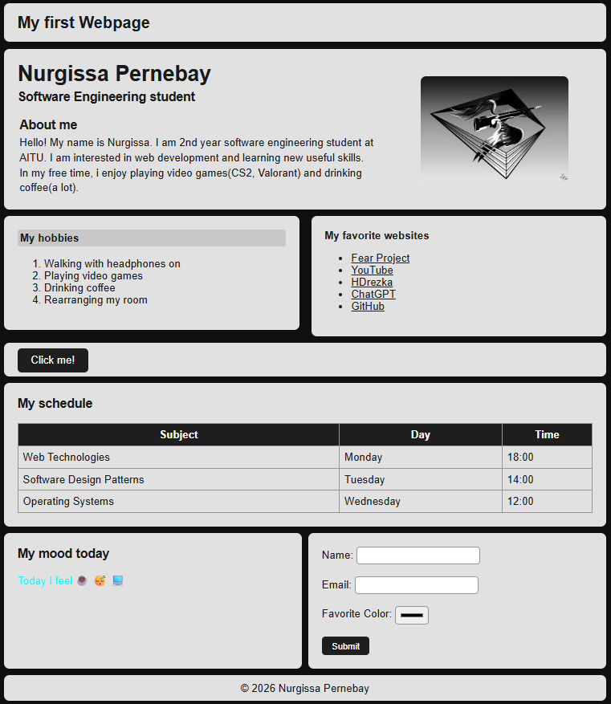

# Assignment 1 - HTML & CSS Basics
Name: Nurgissa Pernebay  
Group: SE-2539
## Part 1 - HTML
Headings, paragraphs, lists, image, links and button.
[Part 1](screenshots/part1.png)
## Part 2 - Intermediate HTML
Table, emojis and form.
[Part 2](screenshots/part2.png)
## CSS
Inline, internal and external CSS, selectors, divs, box model, positioning, sizing, float and clear.
## Final Result

## Summary
I created a personal webpage using HTML and CSS and published it with GitHub Pages.
## Website
https://nurgissa17.github.io/WEBdev-1st/
